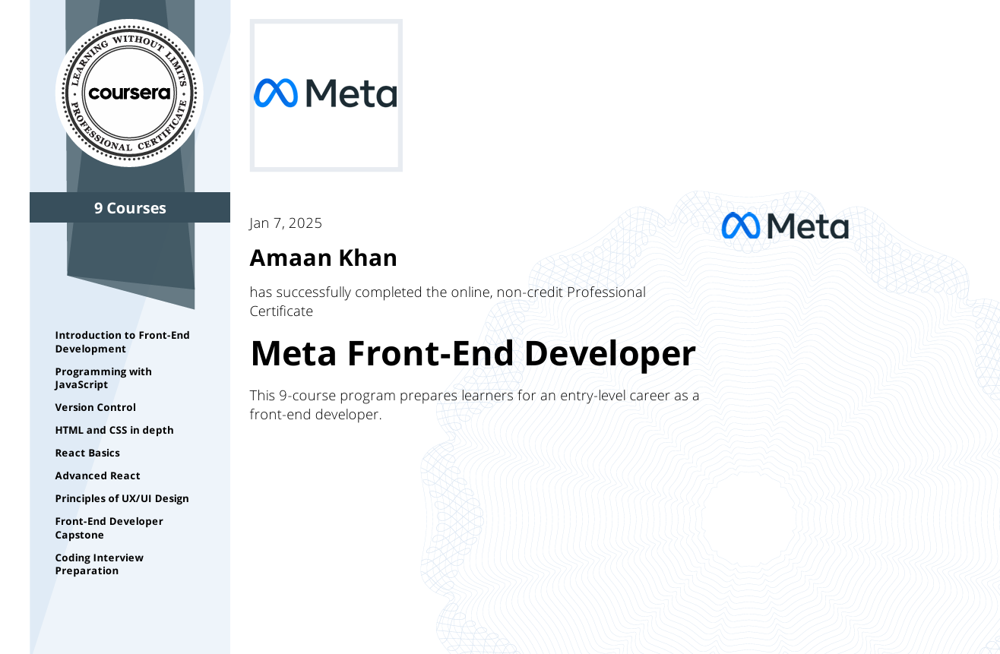

# Meta-Front-End-Developer
Meta Front-End Developer Course This repo includes projects, certificates, and solutions from the Meta Front-End Developer Certificate. It showcases skills in React.js, HTML, CSS, JavaScript, Git/GitHub, Figma (UI/UX), and Bootstrap. Explore dynamic web apps and interactive designs!

